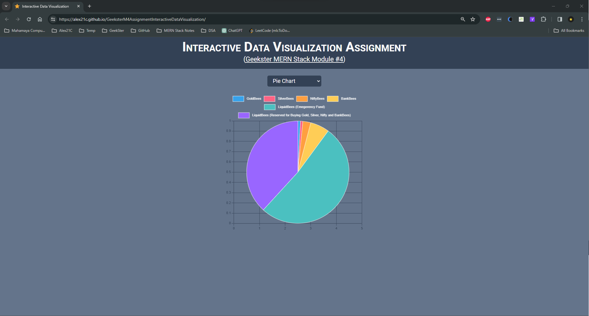

# Assignment, Interactive Data Visualization (Geekster MERN Stack Module 4)
finally after packing & bundling with parcel.js, babel.js ; my assignment is complete, parcel and babel are new to me. the question was in this assignment i'm required to make use of javascript libraries like graph.js and anime.js and i'm strictly against CDN links for production, so i installed them using npm. 
Now question arises it was working fine for my localhost, i completed the development but when posted on github pages for production, my web application broke.
i research and found i need to package and bundle my web app using parcel.js and babel.js and it took me whole 2 days to figure it out exactly how!
and finally its here!

Completed Geekster assignment: Interactive Data Visualization Assignment

<!--  -->

# Tech. Stack Used:

+ [Parcel.js JavaScript Bundler](https://parceljs.org/)
+ [Babel.js JavaScript Compiler](https://babeljs.io/)
+ [regenerator-runtime](https://www.npmjs.com/package/regenerator-runtime)
+ [Chart.js JavaScript Library](https://www.chartjs.org/)
+ [Anime.js JavaScript Library](https://animejs.com/)
+ [MVC Framework](https://en.wikipedia.org/wiki/Model%E2%80%93view%E2%80%93controller)
+ [HTML5](https://en.wikipedia.org/wiki/HTML5)
+ [CSS3](https://en.wikipedia.org/wiki/CSS)
+ [Tailwind CSS](https://tailwindcss.com/)
+ [JavaScript](https://en.wikipedia.org/wiki/JavaScript)
+ [Font Awesome Icons](https://fontawesome.com/icons)
+ [Google Fonts](https://fonts.google.com/)
+ [Git](https://en.wikipedia.org/wiki/Git)
+ [GitHub](https://github.com/)
+ [VS Code](https://code.visualstudio.com/)

# Hosted Version of the Project:
[Geekster M4 Assignment&mdash;Interactive Data Visualization](https://alex21c.github.io/GeeksterM4AssignmentInteractiveDataVisualization/)

# Author
[Abhishek kumar](https://www.linkedin.com/in/alex21c/), ([Geekster](https://geekster.in/) MERN Stack FS-14 Batch)
